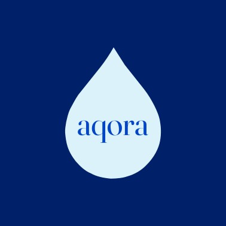
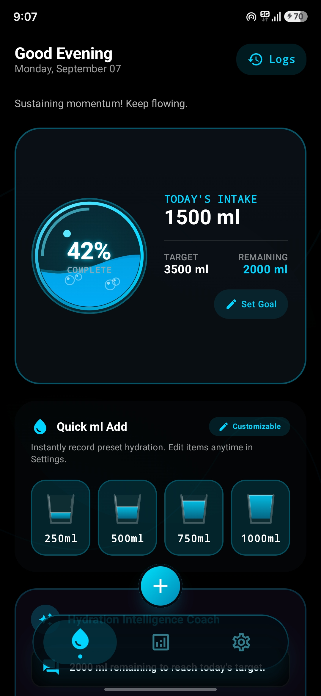
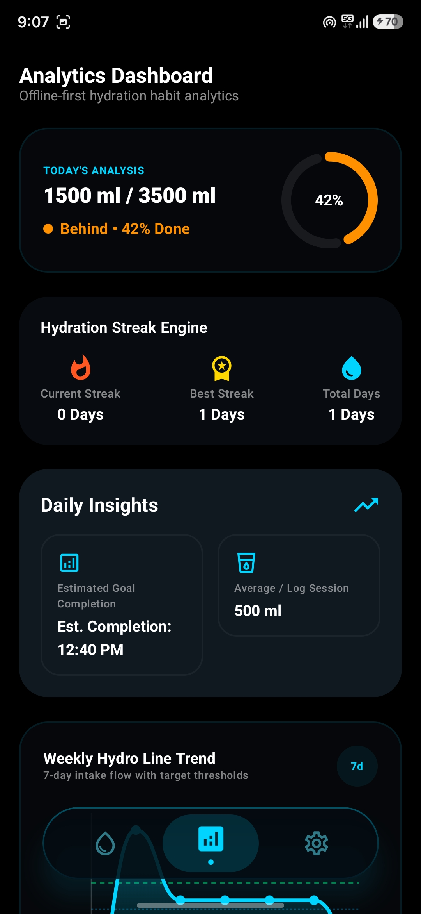
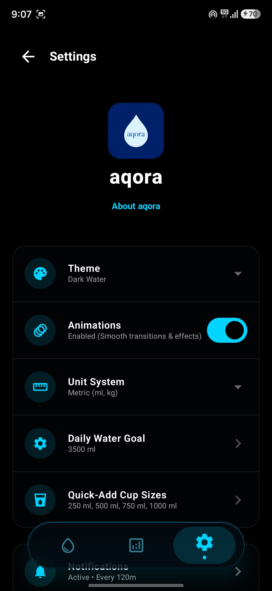

<p align="center">
  
</p>

<h1 align="center">aqora</h1>

<p align="center">
  Privacy-focused • Offline-first • Ultra-fast Hydration Tracking
</p>

<p align="center">
  <strong>Simple hydration tracking. Completely private.</strong>
</p>

---

## 💧 Overview

**aqora** is a privacy-focused hydration tracker for Android built to make tracking your daily water intake **fast, effortless, and completely private**.

Track your water intake, monitor your daily hydration goal, review your history, create custom cups and containers, and stay on top of your hydration through a clean and modern Material 3 interface.

aqora is built around one simple principle:

> **Your hydration data belongs to you.**

No accounts.
No advertisements.
No trackers.
No cloud dependency.

Your data stays on your device.

---

## ✨ Features

* 💧 **Ultra-fast water logging**
* ⚡ **Quick-add hydration shortcuts**
* 🥤 **Custom cups and containers**
* 🎯 **Daily hydration goals**
* 📊 **Real-time hydration progress**
* 📈 **Historical hydration insights**
* 🕒 **Daily intake timeline**
* ✏️ **Edit and delete intake entries**
* ↩️ **Undo actions**
* 🔔 **Hydration reminders**
* 🌊 **Water-inspired interface**
* 🎨 **Light, Dark, System & Water themes**
* 📱 **Modern Material 3 design**
* ♿ **Accessibility support**
* 📶 **Fully offline functionality**
* 🚀 **Fast and responsive performance**
* 🔒 **Local-only data storage**

---

## 📱 Screenshots

|                                    Dashboard                                    |                                    Analytics                                    |
| :-----------------------------------------------------------------------------: | :-----------------------------------------------------------------------------: |
|  |  |

|                                     Settings                                    |
| :-----------------------------------------------------------------------------: |
|  |

---

## 🔒 Privacy First

Privacy isn't an optional feature in aqora — **it's a core design principle**.

aqora does not require or use:

* ❌ User accounts
* ❌ Advertisements
* ❌ Trackers
* ❌ Analytics collection
* ❌ Cloud synchronization
* ❌ Personal data sharing
* ❌ Third-party data collection

### Your data stays on your device.

aqora stores your hydration information locally and does not require an online service to function.

---

## 📶 Offline First

aqora is designed to work **without an internet connection**.

You can:

* Log water offline
* Track your daily hydration goal offline
* View your hydration history offline
* Use custom cups offline
* Access your hydration data without a network connection

No internet connection is required for the core hydration experience.

---

## 🎨 Design

aqora uses **Material 3** to create a modern Android experience while maintaining its own minimal, water-inspired visual identity.

The interface focuses on:

* Clean visual hierarchy
* Large touch targets
* One-handed usability
* Minimal clutter
* Smooth interactions
* Responsive layouts
* Premium typography
* Fast access to frequent actions

The goal is simple:

**Open aqora → see your hydration → log water.**

---

## 🛠️ Tech Stack

* **Kotlin**
* **Jetpack Compose**
* **Material Design 3**
* **Android Jetpack**
* **Room Database**
* **MVVM Architecture**
* **Clean Architecture principles**

---

## 🚀 Installation

Download the latest APK from the **Releases** section and install it on your Android device.

No account or internet connection is required to use aqora.

---

## 🧑‍💻 Development

Clone the repository:

```bash
git clone https://github.com/demonbazillionz/aqora.git
cd aqora
```

---

## 🤝 Contributing

aqora is open source.

Contributions, bug reports, feature ideas, and improvements are welcome.

If you find a bug or have an idea for improving aqora, feel free to open an issue or submit a pull request.

---

## 📄 License

aqora is licensed under the **GNU General Public License v3.0 (GPLv3)**.

See [`LICENSE`](LICENSE) for the complete license text.

---

## 👨‍💻 Developer

Created by **demonbazillionz**

---

<p align="center">
  <strong>aqora — Hydrate. Track. Thrive.</strong>
</p>
