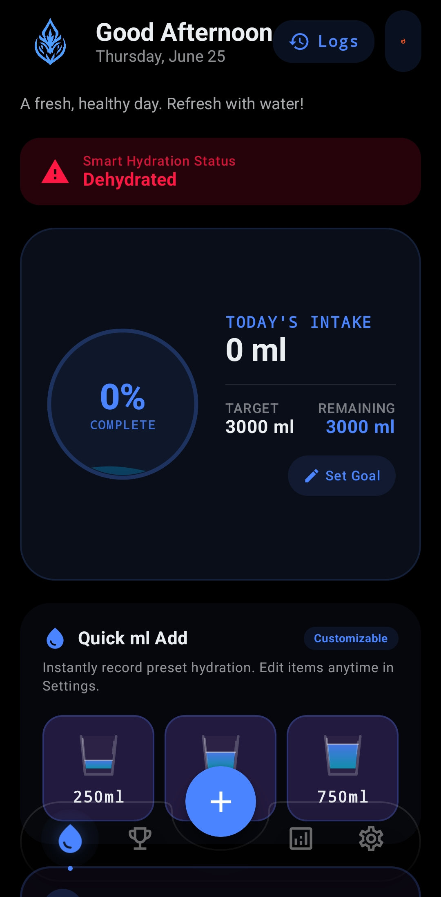
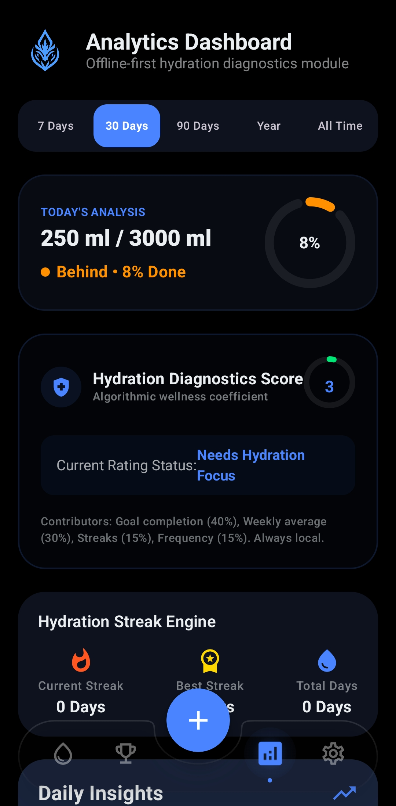
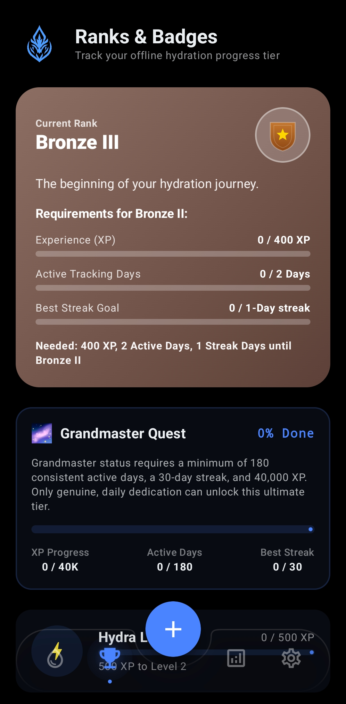
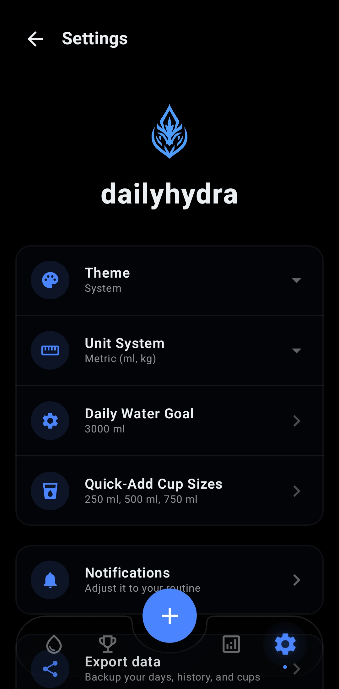

  

<h1 align="center">dailyhydra</h1>

  Privacy-focused • Offline-first • Ultra-fast Hydration Tracking

---

## Overview

dailyhydra is a privacy-focused hydration tracker for Android designed to make daily water tracking fast, effortless, and completely private.

Monitor your hydration progress, review historical trends, and build healthier habits through a clean, modern interface. All data is stored locally on your device, ensuring full privacy and offline functionality.

## Features

* 💧 Quick water intake logging
* ⚡ Custom hydration shortcuts
* 🎯 Daily hydration goal tracking
* 📊 Progress monitoring
* 📈 Historical hydration charts
* 🌊 Water-themed experience
* 🎨 Light, Dark, System, and Water themes
* 🔒 100% local data storage
* 📱 Modern Material 3 design
* 🚀 Fast and responsive performance
* 📶 Fully offline functionality

## Screenshots

| Dashboard                                                | Analytics                                                |
| -------------------------------------------------------- | -------------------------------------------------------- |
|  |  |

| Rank                                                | Settings                                                |
| --------------------------------------------------- | ------------------------------------------------------- |
|  |  |

## Privacy

dailyhydra is built with privacy as a core principle.

* No account required
* No advertisements
* No trackers
* No analytics collection
* No cloud dependency
* No personal data sharing
* Local storage only

Your hydration data never leaves your device.

## Tech Stack

* Kotlin
* Jetpack Compose
* Material Design 3
* Android Jetpack Components
* MVVM Architecture

## Installation

Download the latest APK from the Releases section and install it on your Android device.

## License

This project is licensed under the GNU General Public License v3.0 (GPLv3).

## Developer

Created by **demonbazillionz**